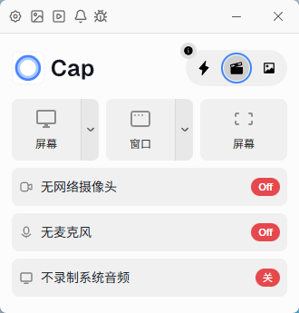
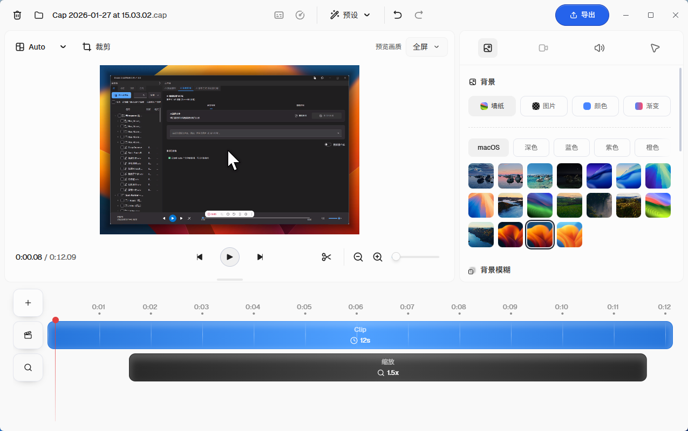

<p align="center">
  <p align="center">
   
  </p>
	<h1 align="center"><b>Cap 中文版</b></h1>
	<p align="center">
		开源屏幕录制工具，基于原项目汉化并优化
    <br />
    <a href="https://github.com/lid664951-crypto/Cap"><strong>GitHub 仓库 »</strong></a>
    <br />
    <br />
    <b>支持平台：</b>
		macOS & Windows
    <br />
  </p>
</p>
<br/>

## 📖 项目简介

Cap 中文版是基于 <a href="https://github.com/CapSoftware/Cap">Cap 官方项目</a> 进行汉化和优化的开源屏幕录制工具，是 Loom 的开源替代方案。它允许您在几秒钟内录制、编辑和分享视频。

## ✨ 主要特性

- **完全汉化**：界面和功能说明已全部汉化，提供更友好的中文用户体验
- **移除登录限制**：无需登录即可使用所有功能
- **去除付费板块**：所有功能完全免费使用
- **同步官方版本**：已同步官方 0.4.3 版本
- **编辑器优化**：优化了视频编辑功能，使用更流畅
- **多平台支持**：支持 macOS 和 Windows 系统

## 📸 界面预览

### 首页


### 编辑器页面


### 设置页面


## 🚀 安装使用

### 方法一：直接运行
1. 从 GitHub 仓库下载最新版本
2. 解压后运行相应平台的可执行文件

### 方法二：源码构建
```bash
# 克隆仓库
git clone https://github.com/lid664951-crypto/Cap.git
cd Cap

# 安装依赖
pnpm install

# 构建桌面应用
pnpm build:desktop

# 运行开发版本
pnpm dev:desktop
```

## 🛠️ 技术栈

- **前端**：React (Next.js)、TypeScript、SolidStart、TailwindCSS
- **后端**：Rust、Tauri、Drizzle (ORM)、MySQL
- **构建工具**：Turborepo

## 📄 许可证

本项目基于原项目的许可证进行分发：

- `cap-camera*` 和 `scap-*` 系列代码使用 MIT 许可证
- 第三方组件使用其原始许可证
- 其他内容使用 AGPLv3 许可证

详细信息请查看 [LICENSE](LICENSE) 文件。

## 🔗 相关链接

- **官方项目**：<a href="https://github.com/CapSoftware/Cap">https://github.com/CapSoftware/Cap</a>
- **本项目**：<a href="https://github.com/lid664951-crypto/Cap">https://github.com/lid664951-crypto/Cap</a>

## 🤝 贡献

欢迎提交 Issue 和 Pull Request 来帮助改进这个项目！

## 📞 联系方式

如有问题或建议，请在 GitHub 仓库中提交 Issue。
